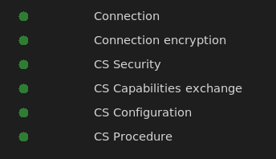
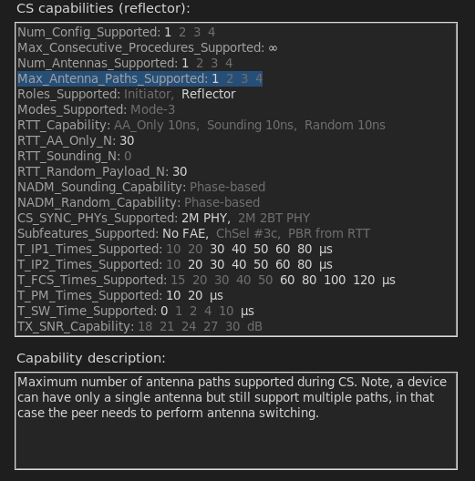
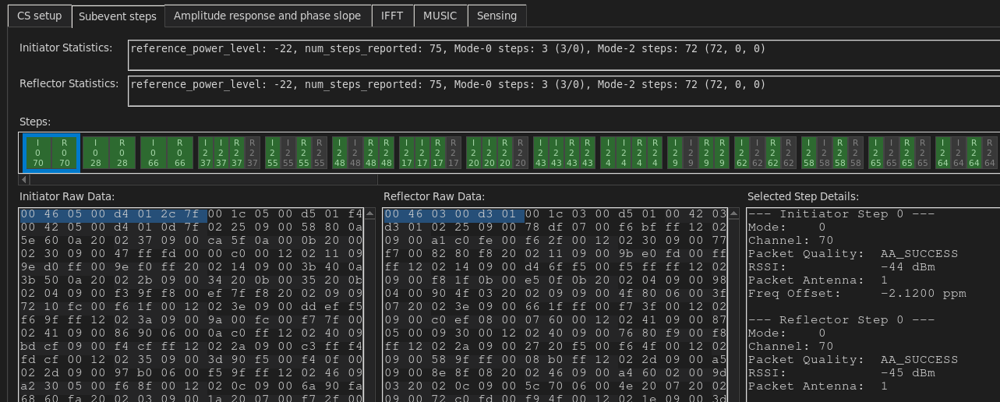
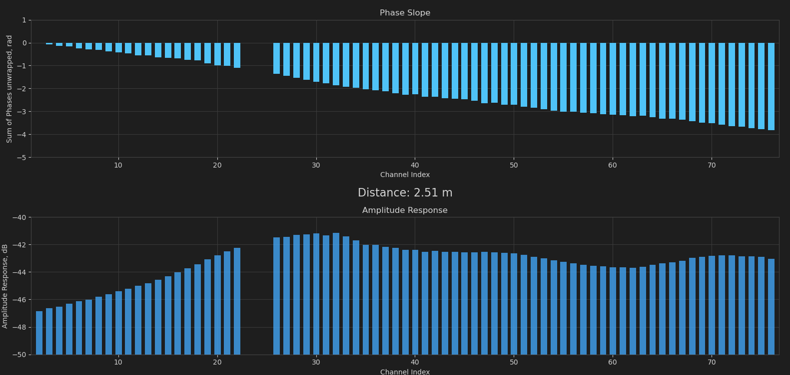
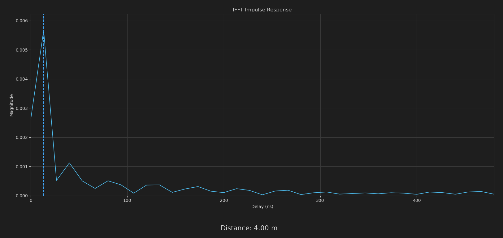
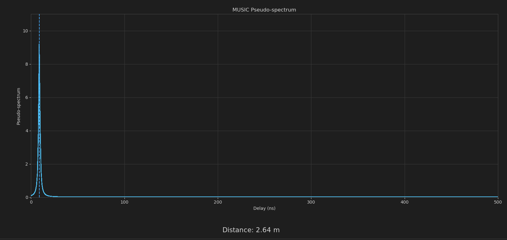
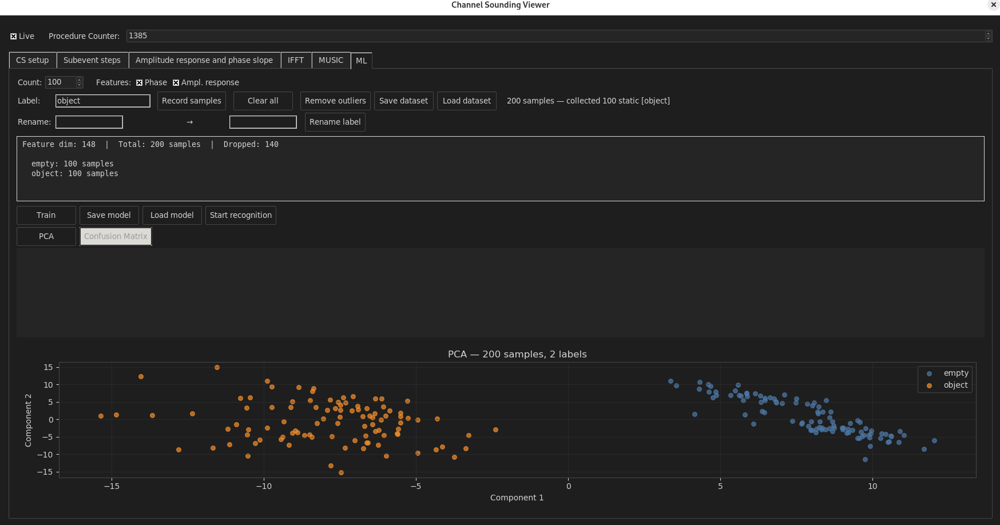
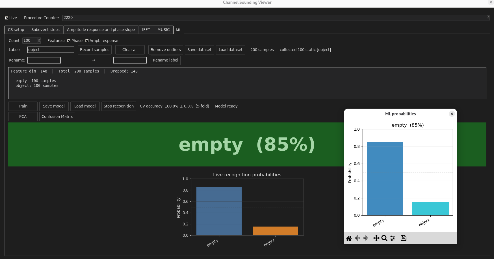
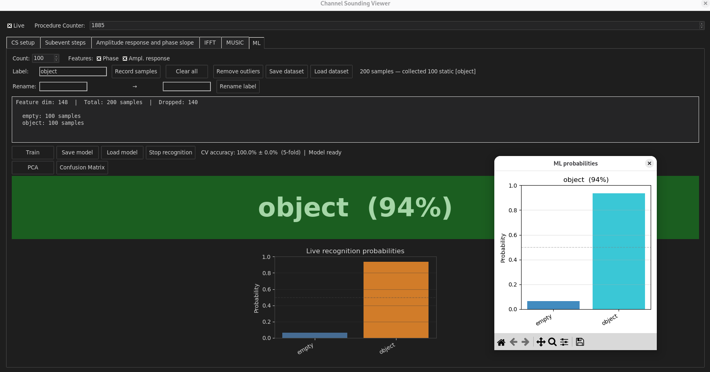

# waves

BLE Channel Sounding phase-based ranging analysis tool

## Background
Channel sounding is BLE 6.0 feature allowing devices to perform measurements of radio medium - specifically, phase and amplitude shift on different channels.

The main use-case of the BLE CS is distance measurement allowing users to find distance between two BLE devices.

The repo provides different tools to learn basic principles of CS tones data processing.

> [!NOTE]
> The repo does not contain any ready-to-use solution for distance measurement, but rather serves as a playground for learning and experimenting with BLE CS data.

## Target audience

Students and researchers interested in DSP and wireless technologies.

Engineers interested in developing their own CS-based algorithms for distance measurements and other applications.

Embedded enthusiasts curious about Channel sounding under the hood.

## Repo structure
* cs_ini  - channel sounding initiator firmware sample for nrf54l15dk
* cs_ref  - channel sounding reflector firmware sample for nrf54l15dk
* toolset - various python tools for channel sounding PBR data processing

## Tutorial

###  How to build and run

Install Python dependencies first:
- `pip3 install -r requirements.txt`

Using physical initiator and reflector boards:
- install NCS 3.2.2 (can skip if using prebuilt .hex for standard nrf54l15 devkits)
- build cs_ini and cs_ref samples (can skip if using prebuilt .hex for standard nrf54l15 devkits)
- flash them to two nrf54l15dk boards
- `python3 run.py -i /dev/ttyACM1 -r /dev/ttyACM3 --uart --log-uart`, adjust COM-port names if needed

Using pre-recorded logs:
- `python3 run.py -i tests/ini.txt -r tests/ref.txt`

### How to use the tool

After starting the tool, it parses the data from Initiator and Reflector, performs processing of the data and displays the results in a GUI. It is possible to scroll through the subevents manually or use "Live" mode to automatically follow the latest subevent.

Python application has the following tabs:

1. CS setup - displays Channel sounding setup procedures and details of capabilities supported by a device.
2. Subevent steps - displays detailed information about each step of the subevent.
3. Amplitude response and phase slope - displays plots of estimated amplitude response and phase shift of the RF channel between two devices, and distance measured based on the phase slope.
4. IFFT - displays plot of inverse FFT of the RF channel response and corresponding distance estimation.
5. MUSIC - displays plot of power spectrum of the RF channel response estimated using mutiple signal classification (MUSIC) algorithm and corresponding distance estimation.

### CS setup tab

Before starting CS procedure, Initiator and Reflector devices have to connect, encrypt connection, run capabilities exchange and CS configuration procedures. The CS setup tab displays status of these procedures, and normally they should be all marked green.

After CS capabilities exchange procedure, the tool displays the capabilities of a device. It provides information about each field in the CS capabilities to give better understanding of what CS features are supported and what possible CS features exist.

### Subevent steps tab

While performing Channel sounding procedure, the tool parses and displays details of each step of the subevent, such as channel number, tone duration, RSSI, etc. This information is useful for debugging and understanding how CS procedure works under the hood.

### Amplitude response and phase slope tab

The I/Q measurements provided by the mode-2 steps can be used to estimate the amplitude response of an RF channel between devices (by how much the signal is attenuated on different frequencies) and the phase shift (by how much the signal is delayed on different frequencies). This data is shown as plots, and the phase slope is used to estimate the distance between devices.

### IFFT

Phase and amplitude response of the RF channel can be used to estimate impulse response of the RF channel using inverse FFT. It is mapped directly to the distance estimation.

Due to limited amount of frequency samples, the IFFT estimation has limited resolution and accuracy.
### MUSIC

To improve resolution of the distance estimation, the tool implements MUSIC algorithm. It also allows to estimate impluse response of the RF channel and estimate the distance more accurately but within assumtions of the algorithm (such as single path channel, given noise nature etc)

## Tutorial on Machine Learning feature

The tool also contains basic Proof-of-concept machine learning feature allowing to train a machine learning model based on a data produced by Channel sounding procedure. This feature can be used for a simple gesture recognition, objects detection etc.

###  How to build and run

Install additional Python requirements:
- `pip3 install -r requirements-ml.txt`

To build and run the application:
- flash cs_ini and cs_ref firmwares to two boards
- `python3 run.py -i /dev/ttyACM1 -r /dev/ttyACM3 --uart --log-uart --ml`, adjust COM-port names if needed

Example of usage ML feature to detect object placed between two boards:
1. Place both boards in front of each other at the fixed positions
2. Open the application `python3 run.py -i /dev/ttyACM1 -r /dev/ttyACM3 --uart --log-uart --ml --ml-handler ml_handler_example.py`
3. Open "ML" tab
4. Collect data for the "Empty" label with 100 samples by pressing "Record samples"
5. Collect data for the "Object" label when there is an object between two boards
6. Press "Train" button to train SVM model based on the collected data
7. Press "Start recognition" to run the model. When object is located between boards, the model should correctly recognize the object; when there is no object, the model should indicate "Empty"

Arguments available when using ML feature:
- `--ml` enable ML feature. Only available when `--uart` is used
- `--ml-handler` is an optional feature to use additional handler processing ML data. See `ml_handler_example.py` source for the details

## Current status

As of now the tool contains:
- CS Initiator and Reflector samples based on Nordic Semiconductor Connect SDK 3.2.2. The samples perform channel sounding procedure and log raw CS data through UART to a PC.
- Python toolset with GUI parsing samples UART output and performing basic processing of the data, such as calculating magnitude and phase shift of each step and printing the statistics of the measurements.

TODO:
- multiple antenna paths support
- mode-3 support
- missing channels interpolation
- extract and use cs configuration, and selected procedure parameters
- improve test coverage

## Links

- [How to install nrf connect sdk](https://docs.nordicsemi.com/bundle/ncs-3.2.2/page/nrf/installation/install_ncs.html)
- [BLE Channel Sounding Tech Overview](https://www.bluetooth.com/channel-sounding-tech-overview/)